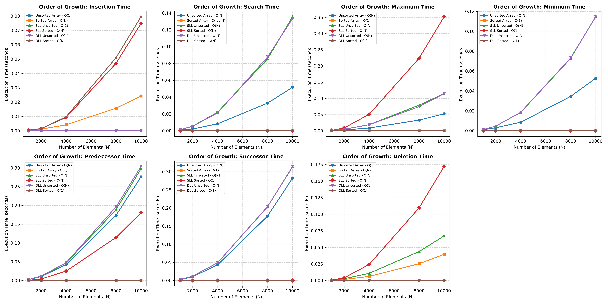

<h1 align="center">📊 Dictionary Operations — Time Complexity Comparison</h1>
<p align="center"><i>Benchmarking six classic data structures across seven core dictionary operations</i></p>

---

### Overview

This question implements and benchmarks **seven primary dictionary operations** across **six different data structures**, analyzing their asymptotic worst-case running times through both theory and empirical measurement.

---

### 📁 Folder Structure

```text
Question_1/
├── a.out
├── q1_plot_results.png
├── q1_plot.py
├── q1.c
├── README.md
└── results.csv
```

---

### ⚙️ Workflow

- **Step 1 — Data Generation**
  The C program (`q1.c`) executes all 42 operations across various input sizes ($N$). Upon completion, it automatically generates and populates a CSV file named `results.csv` with the execution times.

- **Step 2 — Data Visualization**
  The Python script (`q1_plot.py`) reads the data directly from `results.csv` and uses `matplotlib` to create a graph for each operation, saving the final visual as `q1_plot_results.png`.

---

### ⏱️ Time Calculation Methodology

> The C program measures algorithmic performance using the `clock()` function from the `<time.h>` library. It records the CPU clock ticks before and after an operation and divides the difference by `CLOCKS_PER_SEC`. This accurately calculates the exact CPU execution time in seconds, completely filtering out background operating system noise.

---

### 🧮 Asymptotic Worst-Case Time Complexities (TC)

Theoretical worst-case time complexity for all seven operations across the six implemented data structures:

| Operation | Unsorted Array | Sorted Array | Singly Linked Unsorted | Singly Linked Sorted | Doubly Linked Unsorted | Doubly Linked Sorted |
| :--- | :---: | :---: | :---: | :---: | :---: | :---: |
| **Search** | $O(N)$ | $O(\log N)$ | $O(N)$ | $O(N)$ | $O(N)$ | $O(N)$ |
| **Insert** | $O(1)$ | $O(N)$ | $O(1)$ | $O(N)$ | $O(1)$ | $O(N)$ |
| **Delete** | $O(1)$ | $O(N)$ | $O(N)$ | $O(N)$ | $O(1)$ | $O(1)$ |
| **Maximum** | $O(N)$ | $O(1)$ | $O(N)$ | $O(N)$ | $O(N)$ | $O(1)$ |
| **Minimum** | $O(N)$ | $O(1)$ | $O(N)$ | $O(1)$ | $O(N)$ | $O(1)$ |
| **Predecessor** | $O(N)$ | $O(1)$ | $O(N)$ | $O(N)$ | $O(N)$ | $O(1)$ |
| **Successor** | $O(N)$ | $O(1)$ | $O(N)$ | $O(1)$ | $O(N)$ | $O(1)$ |

---

### 📈 Performance Graphs

<p align="center">
  
</p>

**Graph Analysis**

The generated visual is a grid of subplots, each representing one of the seven dictionary operations. The x-axis tracks the number of elements ($N$), and the y-axis tracks the execution time in seconds. By plotting all six data structures together, the graph clearly contrasts their order of growth — constant $O(1)$ time operations appear as flat lines, while $O(N)$ operations show steep upward slopes.
