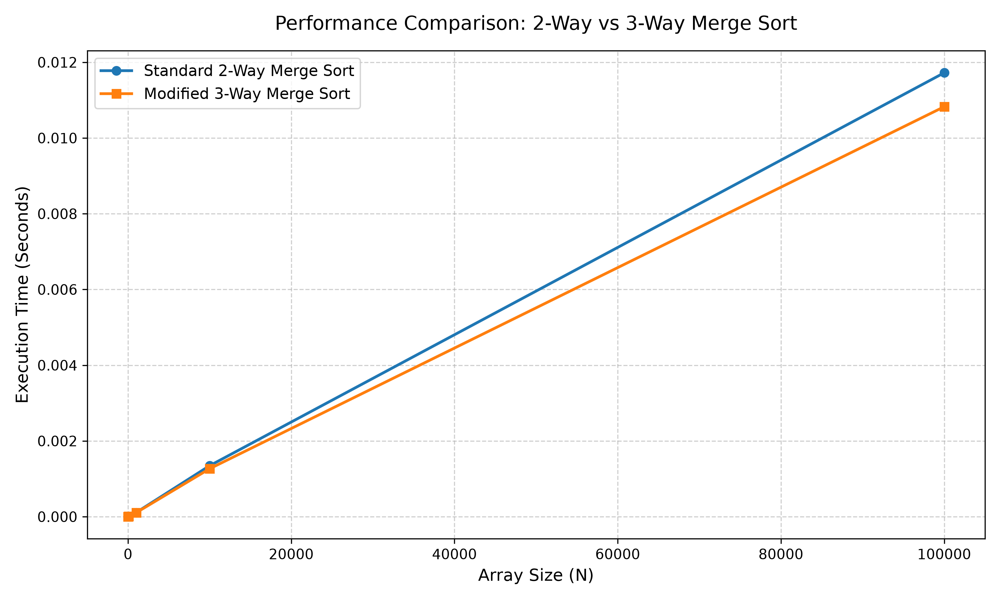

<h1 align="center">🔀 Merge Sort vs. Modified (3-Way) Merge Sort</h1>
<p align="center"><i>Comparing standard 2-way merge sort against a 3-way divide-and-conquer variant</i></p>

---

### Overview

This question explores a modification to the standard merge sort algorithm. Instead of dividing the input array into halves, it divides the array into thirds, recursively sorts each third, and combines the results using a three-way merge subroutine. The goal is to analyze and compare the worst-case asymptotic running times of both approaches.

---

### 📁 Folder Structure

```text
Question_2/
├── a.out
├── merge_sort_plot.png
├── q2_plot.py
├── q2.c
├── README.md
└── results.csv
```

---

### ⚙️ Workflow

- **Step 1 — Data Generation**
  The C program (`q2.c`) implements both the standard 2-way merge sort and the modified 3-way merge sort. It tests both algorithms across incrementally larger array sizes ($N$) and outputs the execution times into a comma-separated values file named `results.csv`.

- **Step 2 — Data Visualization**
  The Python script (`q2_plot.py`) reads the timing data from the CSV file and uses `matplotlib` to plot the execution times against the array sizes. The final visual comparison is saved as `merge_sort_plot.png`.
  > **Note:** Ensure the Python script is set to read `results.csv` to match the C output.

---

### ⏱️ Time Calculation Methodology

> The C program measures algorithmic performance using the `clock()` function from the `<time.h>` library. It records the CPU clock ticks immediately before and after the sorting operations, then divides the difference by `CLOCKS_PER_SEC`. This accurately calculates the pure CPU execution time in seconds, filtering out background operating system tasks.

---

### 🧮 Asymptotic Worst-Case Time Complexities (TC)

Both algorithms belong to the $O(N \log N)$ complexity class, but their exact mathematical derivations and constant factors differ:

**1. Standard Merge Sort (2-Way)**

| Aspect | Detail |
| :--- | :--- |
| Division | The array is split into 2 halves |
| Recursion Depth | The height of the recursion tree is $\log_2 N$ |
| Merge Work | Merging 2 sorted halves takes $O(N)$ time |
| **Total Worst-Case TC** | $T(N) = 2T(N/2) + O(N) \implies O(N \log_2 N)$ |

**2. Modified Merge Sort (3-Way)**

| Aspect | Detail |
| :--- | :--- |
| Division | The array is split into 3 thirds |
| Recursion Depth | The height of the recursion tree is shallower, at $\log_3 N$ |
| Merge Work | Merging 3 sorted thirds (done here by merging the first two, then merging the result with the third) takes $O(2N/3) + O(N) \approx O(N)$ time |
| **Total Worst-Case TC** | $T(N) = 3T(N/3) + O(N) \implies O(N \log_3 N)$ |

Because $\log_3 N$ is proportional to $\log_2 N$ (specifically, $\log_3 N \approx 0.63 \log_2 N$), the overall asymptotic complexity remains **$O(N \log N)$**. However, the 3-way merge sort has a shallower recursion tree but performs slightly more complex comparisons at each level during the merge phase.

---

### 📈 Performance Graphs

<p align="center">
  
</p>

**Graph Analysis**

The line graph compares the order of growth between the standard 2-way merge sort and the modified 3-way merge sort. The x-axis tracks the array size ($N$), while the y-axis tracks the execution time in seconds. Because both algorithms share an $O(N \log N)$ time complexity, their growth curves will closely mirror each other, with any slight divergence attributed to the constant factors (recursion overhead vs. merging overhead).

