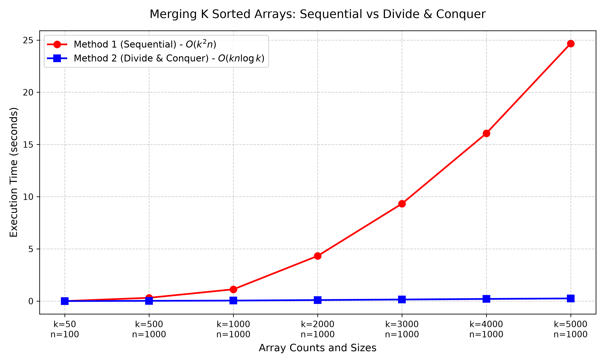

<h1 align="center">🧩 Merging K Sorted Arrays: Sequential vs Divide & Conquer</h1>
<p align="center"><i>Comparing a naive sequential merge against a divide-and-conquer merge for k sorted arrays</i></p>

---

### Overview

This question explores two distinct algorithms for merging $k$ sorted arrays, each containing $n$ elements, into a single sorted array of $kn$ elements. The objective is to analyze, implement, and benchmark a sequential merging approach against a divide-and-conquer approach.

---

### 📁 Folder Structure

```text
Question_3/
├── a.out
├── q3_merge_plot.png
├── q3_plt.py
├── q3.c
├── README.md
└── results.csv
```

---

### ⚙️ Workflow

- **Step 1 — Data Generation**
  The C program (`q3.c`) generates random arrays, sorts them, and merges them using both methods. It tests the algorithms across incrementally larger values of $k$ and outputs the execution times into a CSV file named `results.csv`.

- **Step 2 — Data Visualization**
  The Python script (`q3_plt.py`) reads the timing data from `results.csv` and uses `matplotlib` to plot a line graph comparing the execution times of both methods. The visual is saved as `q3_merge_plot.png`.

---

### ⏱️ Time Calculation Methodology

> The C program measures algorithmic performance using the `clock()` function from the `<time.h>` library. It records the CPU clock ticks immediately before and after the merge operations, then divides the difference by `CLOCKS_PER_SEC`. This accurately calculates the pure CPU execution time in seconds, filtering out background operating system noise.

---

### 🧮 Asymptotic Worst-Case Time Complexities (TC)

The two methods differ drastically in their theoretical time complexities, primarily due to how repeatedly the same elements are evaluated during the merge process.

**Method 1: Sequential Merge**

| Aspect | Detail |
| :--- | :--- |
| Approach | Merges array 1 and 2, then merges the result with array 3, then that result with array 4, and so on |
| Derivation | The first merge processes $2n$ elements. The second processes $3n$ elements. The $k^{th}$ processes $kn$ elements. The total work is the sum of an arithmetic progression: $n(2 + 3 + \dots + k)$ |
| **Total Worst-Case TC** | $O(k^2 n)$ |

**Method 2: Divide & Conquer Merge**

| Aspect | Detail |
| :--- | :--- |
| Approach | Pairs up the $k$ arrays and merges each pair. This cuts the number of arrays in half. It repeats this pairing and merging process until only one array remains |
| Derivation | At each level of the recursion tree, a total of $kn$ elements are merged. The number of times we can halve the $k$ arrays is $\log_2 k$ |
| **Total Worst-Case TC** | $O(kn \log k)$ |

---

### 📈 Performance Graphs

<p align="center">
  
</p>

**Graph Analysis**

The line graph tracks the execution time in seconds as the number of arrays ($k$) increases. The red line represents Method 1 (Sequential Merge), which demonstrates steep, parabolic growth indicative of its $O(k^2 n)$ complexity. The blue line represents Method 2 (Divide & Conquer), which stays remarkably flat by comparison, cleanly demonstrating the high efficiency of its $O(kn \log k)$ complexity.
