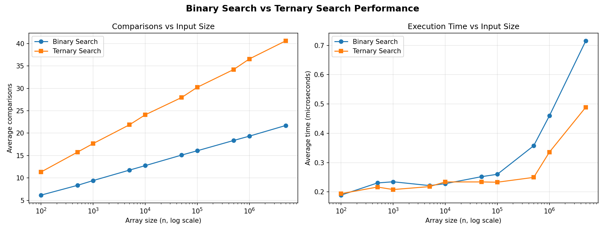

# Binary vs Ternary Search

## Problem Statement
In binary search, an n element list is divided into nearly two equal halves, while in ternary search, it is divided into nearly three equal intervals. Then the search will be in one of the intervals. Design and implement a C program to search for an element `x` in a sorted list of size `n` using binary and ternary search. Justify and validate that binary search is better than ternary search via your implementation.

## Implementation

```c
int binarySearch(int arr[], int n, int x) {
    int low = 0, high = n - 1;

    while (low <= high) {

        int mid = low + (high - low) / 2;

        if (arr[mid] == x)
            return mid;
        else if(arr[mid] < x)
            low = mid + 1;
        else{
            high = mid - 1;
        
        }
    }

    return -1;
}

int ternarySearch(int arr[], int n, int x) {
    int low = 0, high = n - 1;

    while (low <= high) {
        int mid1 = low + (high - low) / 3;
        int mid2 = high - (high - low) / 3;


        if (arr[mid1] == x)
            return mid1;

        if (arr[mid2] == x)
            return mid2;

        if (x < arr[mid1])
            high = mid1 - 1;
        else if (x > arr[mid2])
            low = mid2 + 1;
        else {
            low = mid1 + 1;
            high = mid2 - 1;
        }
    }

    return -1;
}
```

## Validation & Justification

To back up the claim that binary search beats ternary search, `benchmark.c` instruments both functions with a global comparison counter and runs them on sorted random arrays of sizes 100 → 5,000,000, averaged over 2000 searches per size (mix of present/absent targets). Results are logged to `results.csv` and plotted in `search_comparison.png`.

| n | Binary avg comparisons | Ternary avg comparisons | Binary avg time (µs) | Ternary avg time (µs) |
|---|---|---|---|---|
| 100 | 6.19 | 11.34 | 0.189 | 0.194 |
| 1,000 | 9.43 | 17.68 | 0.235 | 0.208 |
| 10,000 | 12.76 | 24.09 | 0.228 | 0.234 |
| 100,000 | 16.08 | 30.23 | 0.260 | 0.233 |
| 1,000,000 | 19.33 | 36.55 | 0.460 | 0.336 |
| 5,000,000 | 21.71 | 40.60 | 0.716 | 0.489 |



**Why binary search wins:**
- **Recurrence / complexity:** Binary search satisfies `T(n) = T(n/2) + 2` → `O(log₂ n)`. Ternary search satisfies `T(n) = T(n/3) + 4` → `O(2·log₃ n)`. Since `2·log₃ n ≈ 1.26·log₂ n`, ternary search theoretically needs **more comparisons per search**, even though it shrinks the range by a factor of 3 each step.
- **Empirical confirmation:** the benchmark shows binary search consistently needs roughly **half as many comparisons** as ternary search at every input size, and the gap holds steady as `n` grows (log-scale in the plot).
- **Why ternary loses despite dividing into 3 parts:** each ternary iteration costs 2 array accesses and up to 3 conditional comparisons (vs. 1 access and up to 2 comparisons for binary), which outweighs the benefit of the smaller sub-range.

## Conclusion
Both algorithms run in logarithmic time, but binary search is asymptotically and empirically more efficient than ternary search for searching a sorted array, since it needs fewer comparisons per search despite ternary search partitioning the array into more segments per step.

## Files
- `search.c` — core implementation answering the problem statement
- `benchmark.c` — instrumented version used to generate comparison/timing data
- `results.csv` — raw benchmark data
- `search_comparison.png` — comparisons & timing plots